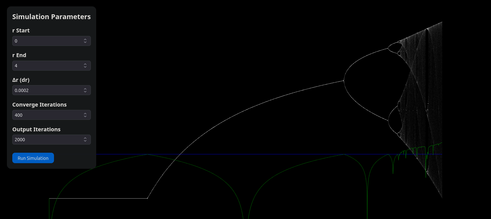

## Lyapunov's fractals and iterative maps

The orbit diagram plotter demo can be viewed here: 

The iterative map $x_{n+1} = rx_n(1-x_n)$ orbit is plotted to give the famous orbit diagram. 

In addition the lyapunov coeffecient is plotted and you can clearly see that when it's greater than 0, chaos ensues. 

 

But now comes the even more fun part!
We can now change the growth factor `r` in a fixed sequence. 
Recomended video [here](https://www.youtube.com/watch?v=yGwy2WyQCQE)

And I just wanted something to practice CUDA with! This was perfect to implement some GPU speedups!

The Kernel code is [here](CUDA_Fractal/kernel.cu)

The launcher is called from main.cpp and is responsible for creating the memory space in the GPU and launching the kernel.

The results are quite nice! I have had to remove the higher resolution ones cause theyre too big even for git lfs without paying. The ooutput is in ppm  format but ive post converted them to png for ease of use

Here are some cool ones:

Zircon city
[Zircon city](seq-BBBBBBAAAAAA_iters-2000_xmin-2.50_ymin-3.40_w-0.90_h-0.60_nx-2048_ny-2048.png)
